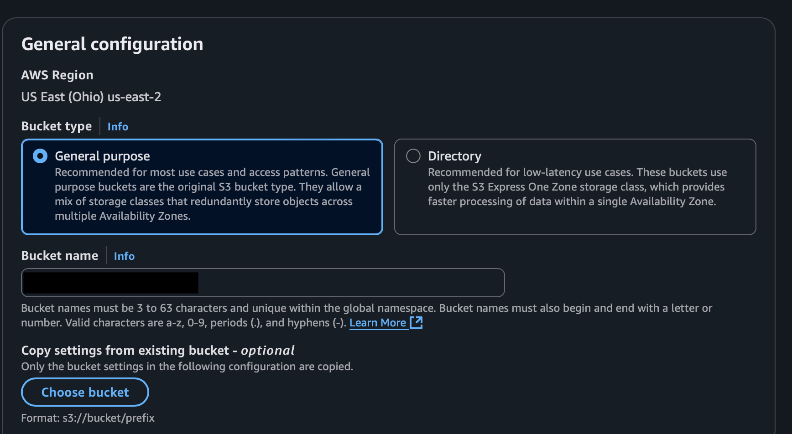
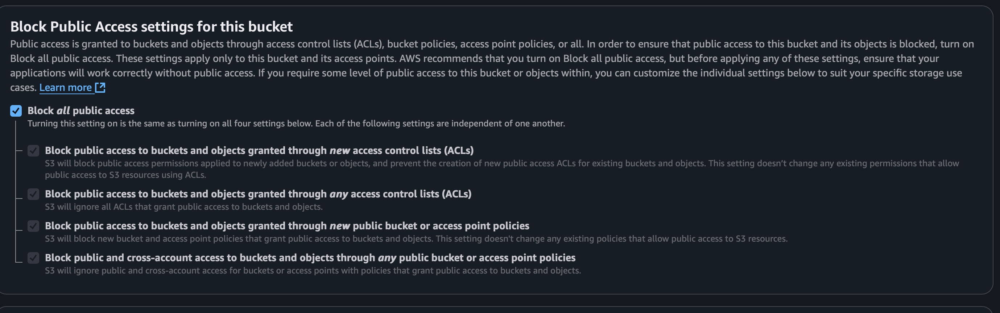
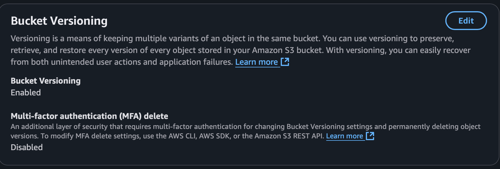
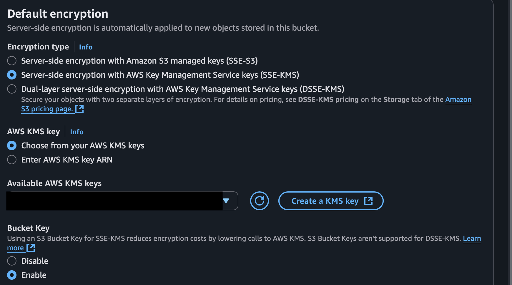
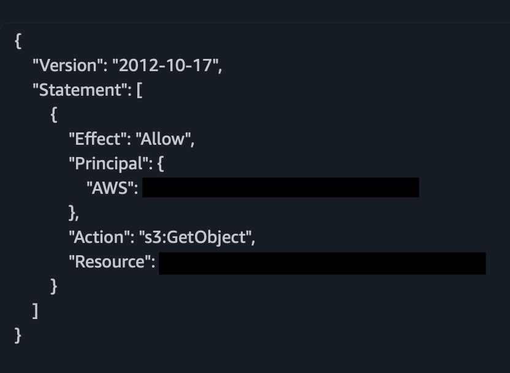
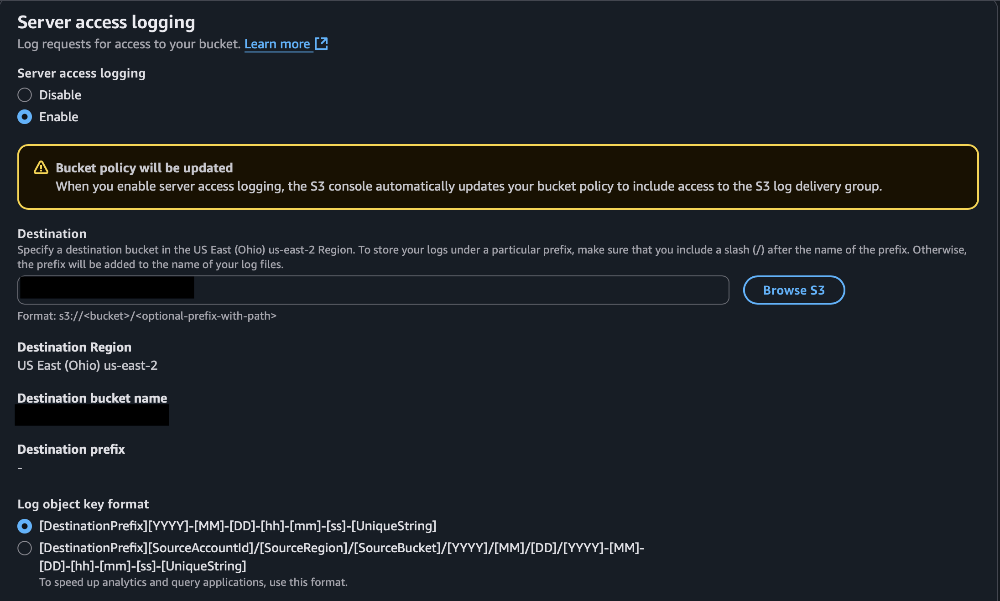

# 🔐☁️ Securing Data in AWS S3 Buckets

This project walks through securing an Amazon S3 bucket, a widely used cloud storage service. It covers the core steps for protecting stored data: creating a private bucket, enabling versioning, applying server-side encryption, managing access through policies, and configuring logging for audit purposes.

## 🔧 Tools & Skills
  - Platform: AWS S3
  - Security Features: Bucket policies, encryption (KMS), access logging
  - Skills: IAM permissions, cloud storage hardening, CLI basics

## 🧪 Exercises

### Exercise 1: Create a Secure S3 Bucket

- Created a bucket
- Enabled the “Block all public access” option to prevent unauthorized access

*Create S3 bucket.*

*Block all public access.*

### Exercise 2: Enable Bucket Versioning

- Enabled versioning under the bucket’s Properties tab

*Bucket Versioning enabled.*

### Exercise 3: Enable Server-Side Encryption (SSE-KMS)

- Enabled default encryption using AWS Key Management Service (KMS)
- Selected an AWS-managed KMS key

*AWS-KMS encryption enabled.*

### Exercise 4: Set a Bucket Policy

- Added a policy to allow read-only access to a specific IAM user

*Policy that allows a specific username to read any object from the S3 bucket.*

### Exercise 5: Enable Access Logging

- Turned on server access logging
- Set my-log-bucket as the target for log storage

*Server access logging is enabled and the target bucket for logs is set.*

## 🧠 What I Learned

- How to configure core AWS S3 security settings
- The role of encryption, access control, and logging in data protection
- How versioning supports data recovery and auditing
- Real-world use of IAM and bucket policies for secure access

## 📚 Credits

This project is based on a guided exercise originally published on GitHub. I completed and documented it as part of my cybersecurity portfolio.
