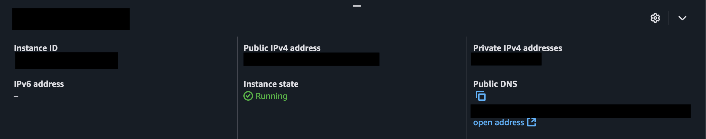
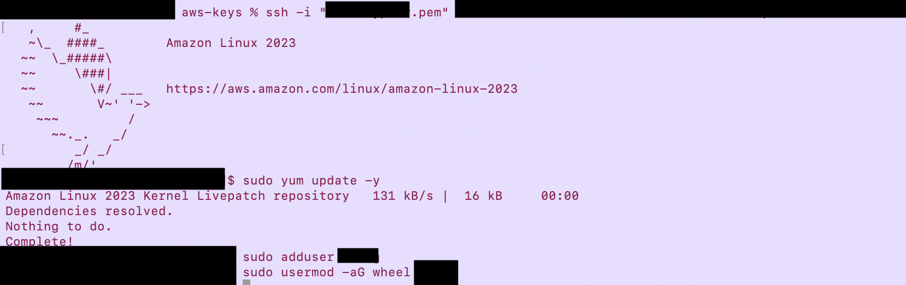
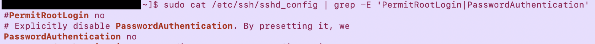
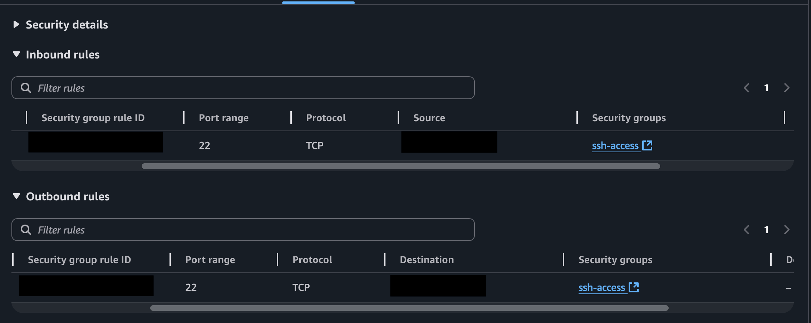
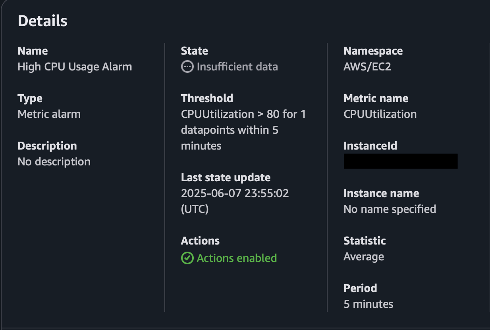

# ☁️🔒 Securing AWS EC2 Instances 

This project walks through the process of launching and securing an Amazon EC2 instance. It covers key areas like setting up security groups, managing SSH access with key pairs, hardening the instance, and configuring basic monitoring with CloudWatch.

## 🎯 Objective

- Launch an EC2 instance using Amazon Linux 2 AMI
- Set up secure SSH access with key pairs
- Apply system updates and limit root access
- Configure AWS security groups as a basic firewall
- Set up monitoring with Amazon CloudWatch

## ⚙️ Tools Used
- AWS
- EC2
- IAM
- Security Groups
- CloudWatch
- Amazon Linux 2
- SSH

## 👣 Project Steps

### 1. Launch an EC2 Instance

1. Log in to the [AWS Management Console](https://aws.amazon.com/console/).
2. Navigate to the EC2 Dashboard.
3. Click on "Launch Instance".
4. Choose an Amazon Machine Image (AMI) (e.g., Amazon Linux 2 AMI).
5. Select an instance type (t2.micro is free tier eligible).
9. Configure Security Group:
    - Create a new security group.
    - Add a rule to allow SSH (port 22) from your IP.
10. Review and launch the instance.
11. Select "Create a new key pair", name it, and download the key pair.
12. Launch the instance.


*Dashboard showing EC2 instance is running successfully.*

### 2. Connect via SSH
  - Open your terminal.
  - Navigate to the directory where your key pair is stored.
  - Change the permissions of your key pair file:
    ```bash
    chmod 400 your-key-pair.pem
    ```
  - Connect to your instance using the public DNS:
    ```bash
    ssh -i "your-key-pair.pem" ec2-user@your-instance-public-dns
    ```
    

*Successfully connected to the EC2 instance via SSH.*

### 3. Secure the Instance

- update system package and install security updates:
```bash
sudo yum update -y && sudo yum upgrade -y
```

- Add new user and grant sudo access:
```bash
sudo adduser newuser
sudo usermod -aG wheel newuser
```


*Update and securing the EC2 Instance.*

### 4. Harden SSH access
    - Edit the SSH configuration file:
        ```bash
        sudo vi /etc/ssh/sshd_config
        ```
    - Disable root login:
        ```plaintext
        PermitRootLogin no
        ```
    - Allow only key-based authentication:
        ```plaintext
        PasswordAuthentication no
        ```
    - Restart the SSH service:
        ```bash
        sudo systemctl restart sshd
        ```


*Disable root login & disable password authentication*

### 5. Configure a Basic Firewall

1. In the AWS Management Console, navigate to the EC2 Dashboard.
2. Select your instance and go to the "Security" tab.
3. Click on the security group associated with your instance.
4. Edit the inbound rules:
    - Remove the SSH rule allowing access from anywhere.
    - Add an SSH rule allowing access only from your IP address.
5. Edit the outbound rules (if necessary).


*Inbound and outbound rules for EC2 instance that allows only my IP addr on port 22.*

### 6. Set up CloudWatch Monitoring

1. In the AWS Management Console, navigate to the CloudWatch Dashboard.
2. Click on "Alarms" and then "Create Alarm".
3. Select the "EC2" metric and choose your instance.
4. Configure the alarm (e.g., CPU utilization > 80% for 5 minutes).
5. Set up notifications (e.g., via email).
6. Review and create the alarm.


*CloudWatch alarm that monitors CPU utilization of the EC2 instance and send an email notification if it stays above 80% for 5 minutes.*

## 📘 What I Learned
- How to securely configure an EC2 instance from launch to production-readiness
- Practical use of IAM, key pair management, security groups, and SSH hardening
- Basics of cloud monitoring and alerting in AWS

## 📚 Credits

This project is based on a guided exercise originally published on GitHub. I completed and documented it as part of my cybersecurity portfolio.
