# 🕵️🔍 Monitoring and Logging in Azure with Log Analytics & Activity Logs

This project demonstrates how to monitor and analyze activity within an Azure environment using Azure Monitor and Log Analytics. Through hands-on exercises, you'll configure diagnostic settings to collect logs, route them to a Log Analytics workspace, and run queries to investigate user actions and resource changes. This lab provides practical experience in implementing foundational monitoring practices and understanding Azure's logging capabilities for better visibility and security.

## 🧰 Tools & Services

- Azure Portal
- Azure Monitor
- Log Analytics Workspace
- Activity Logs
- Azure Resource Group

## 🛠 Lab Setup Instructions
### 🔑 Prerequisites

- Azure account (free trial available)
- Basic understanding of cloud computing concepts

## 🧪 Exercises

### Exercise 1: Create a Resource Group

- Go to Azure Portal > Search for Resource Group > click Create
- Name: MonitoringLabRG
- Pick any Region

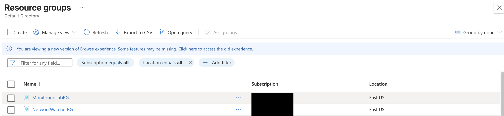
*Creating a resource group.*

### Exercise 2: Create a Log Analytics Workspace
1. Search for Log Analytics Workspaces > click Create
2. Use the following:
   - Set name: MonitorLogsWorkspace
   - Assign it to *MonitoringLabRG*
   - Region: Same as your resource group

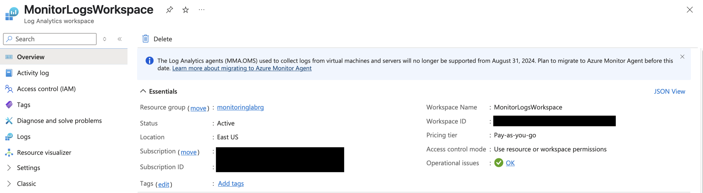
*Creating a log analytics workspace.*

### Exercise 3: Enable Azure Activity Logs to be sent to Log Analytics
- Go to Monitor > Activity Log > Diagnostic Settings
- Click Add diagnostic setting
- Name: SendToLogAnalytics
- Select "Send to Log Analytics workspace"
- Choose *MonitorLogsWorkspace*
- Select all log categories (Administrative, Policy, etc.)
  
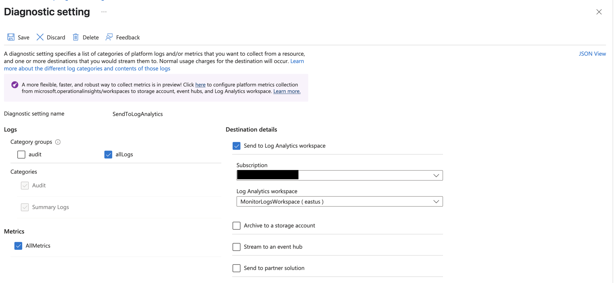
*Configuring diagnostic settings to send logs to Log Analytics.*

### Exercise 4: Simulate Activity

#### Create a resource
- Go to home > Create a resource > Storage Account > Create
- Fill in:
  - Resource Group: MonitoringLabRG
  - Name: storagesimlog01
  - Region: same as your workspace

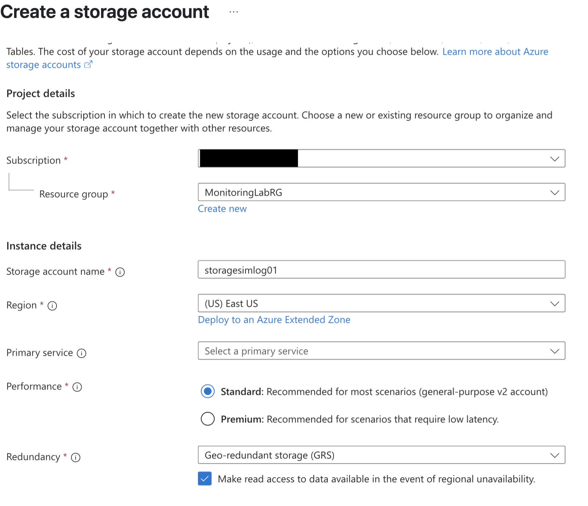
*Creating a resource (storage account).*

#### Modify an Exisiting Resource
- Go to Resource Groups > MonitoringLabRG
- Click on your *storagesimlog01*
- In the left pane, go to *Configuration*
- Change any setting and save

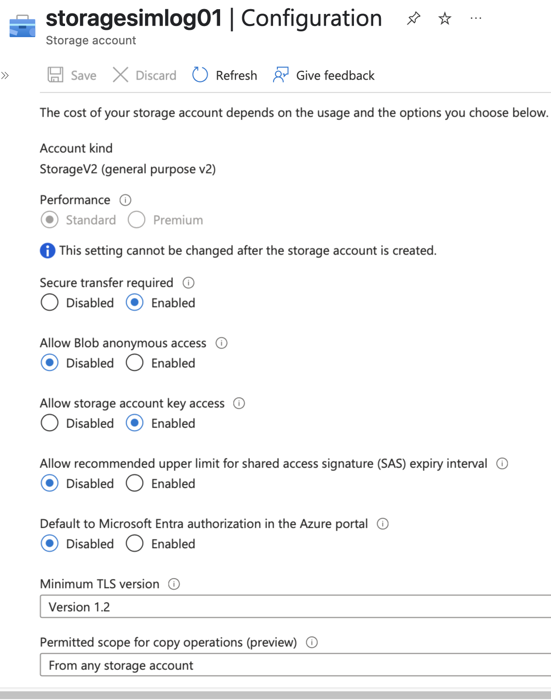
*Modifying a resource (storage account).*

#### Delete a resource
- Go to Home > Resource Group > MonitoringLabRG
- Select *storagesimlog01*

#### Assign a Role to a User
- Go to Subscriptions
- Click your subscription
- Click Access Control (IAM) > Add role assignment
- Choose the role *Reader* and assign it to yourself

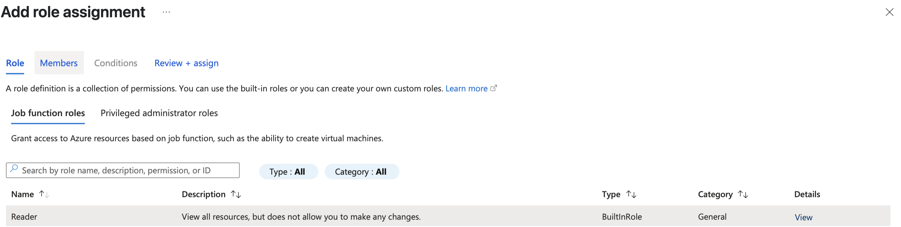
*Selecting a role.*

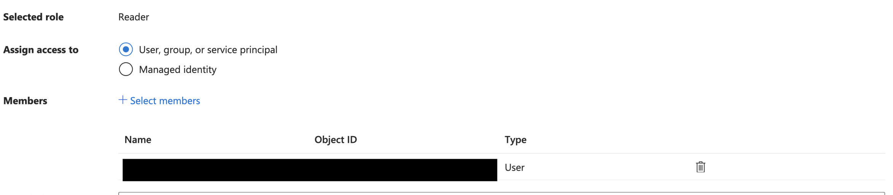
*Assign a member to the role.*

### Exercise 5: Query Logs in Log Analytics
- Go to Monitor > Logs
- Make sure your workspace is selected
- Run query (sample queries are listed below)
  
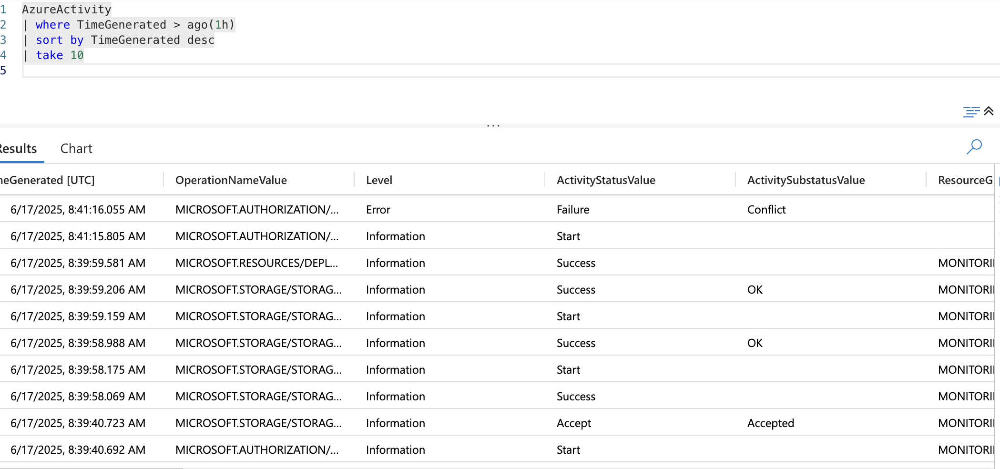
*Query that shows the 10 most recent Azure activity log events from the last hour.*

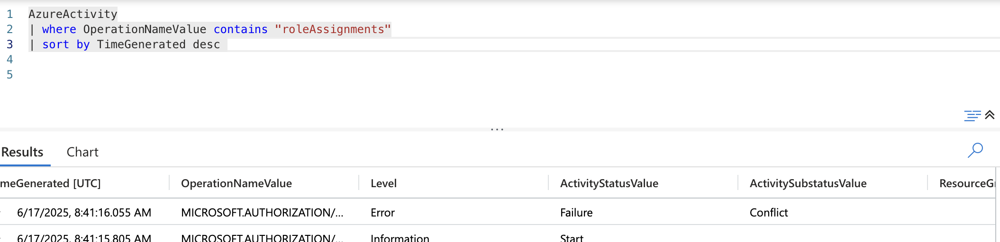
*Query that lists recent Azure activities related to role assignment changes.*

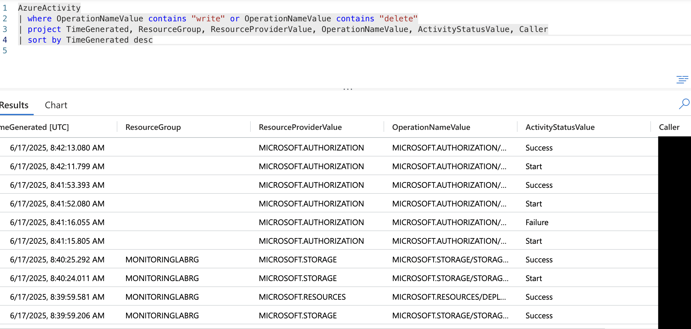
*Query that lists recent create/update or delete operations in Azure.*

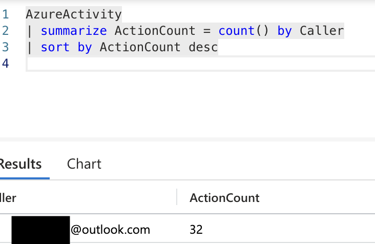

*Query that shows who did the most actions.*

## 🧠 What I Learned
- How to configure diagnostic settings to collect Azure activity logs.
- How to route logs to a Log Analytics workspace for better visibility and querying.
- How to use Kusto Query Language (KQL) to explore and analyze logs.

## 📚 Credits

This project is based on a guided exercise originally published on GitHub. I completed and documented it as part of my cybersecurity portfolio.
