# 🔍 Splunk Security Monitoring Lab

## 🧠 Overview

This lab demonstrates how to use Splunk to monitor system logs, detect suspicious activity, and build basic dashboards for threat hunting. It’s a hands-on project aimed at showcasing skills in log ingestion, search processing (SPL), and incident investigation using Splunk.

## 🛠 Lab Setup Instructions

- **Splunk Enterprise** (Free Trial)
- **Windows 10 VM** (or local Windows machine)
- **Splunk Universal Forwarder** for collecting logs
- Enable **Windows Security Auditing**
    
## 🧪 Lab Exercises

### Exercise 1: Splunk Installation

- Install Splunk Enterprise on a local machine.
- Access the dashboard via `http://localhost:8000`.
- Create admin account and completed setup.

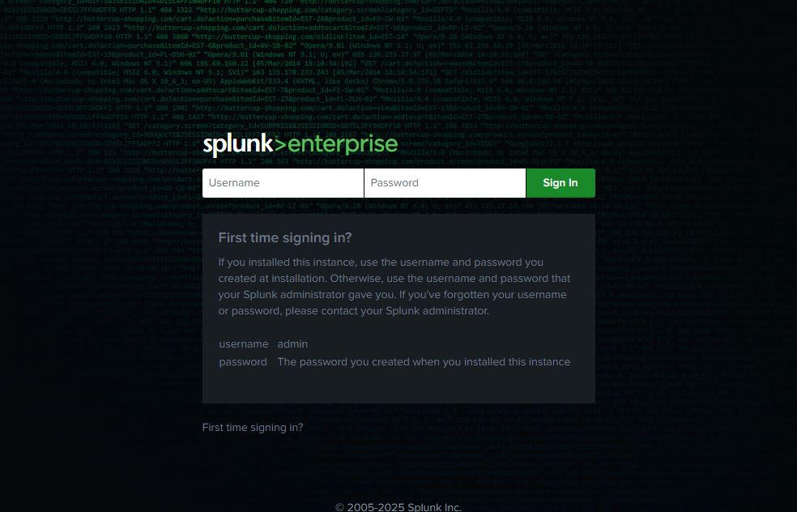
*Initial login screen showing access to the Splunk instance after installation.*

### Exercise 2: Ingesting Data

1. On your Splunk Enterprise instance, enable receiving data on port **9997**.
   - Go to **Settings** -> **Fowarding adn receiving** -> **Receive data**.
   - Click **Add new** and set port to **9997**.
   - Save the configuration.

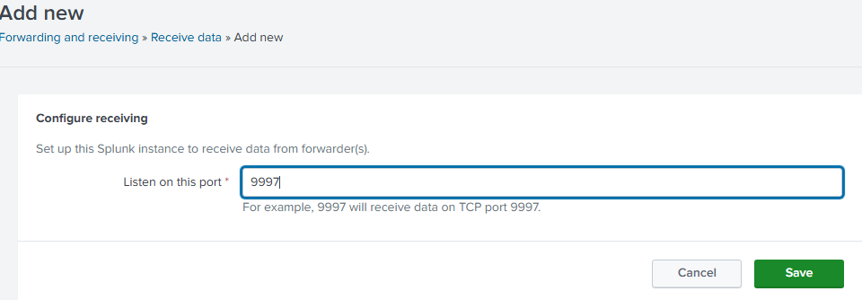
*Configuring the Splunk indexer to listen on port 9997 for data forwarded by Universal Forwarder.*

2. Install and Configure the Splunk Universal Forwarder
   - Install the Splunk Universal Forwarder
   - Conect the forwarder to the indexer using:
 ```powershell
 splunk add forward-server 127.0.0.1:9997
 ```
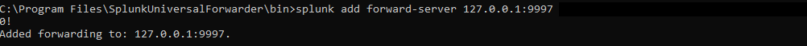
*Shows successful configuration of the Universal Forwarder to send logs to Splunk*

3. Enable Security Auditing
   - Open the **Local Security Policy** (secpol.msc)
   - Navigate to:
   - Local Policy → Audit Policy
   - Enable **Succes*** and **Failure** for the following:
     - Audit account logon events
     - Audit account management
     - Audit logon events
     - Audit object access
     - Audit policy change
     - Audit privilege use
     - Audit process tracking
     - Audit system events
       
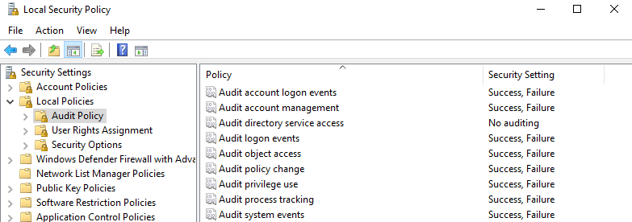

*Enable auditing of process creation to generate EventCode 4686 for Splunk Monitoring.*

4. Configure it to monitor and forward the following Windows logs:
```powershell
splunk add monitor "C:\Windows\System32\winevt\Logs\Security.evtx"
splunk add monitor "C:\Windows\System32\winevt\Logs\System.evtx"
splunk add monitor "C:\Windows\System32\winevt\Logs\Application.evtx"
splunk add monitor "C:\Windows\System32\winevt\Logs\Microsoft-Windows-Sysmon%4Operational.evtx"
```
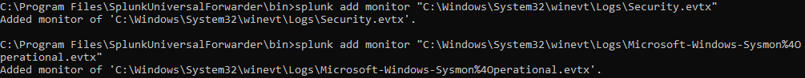
*Configure the Universal Forwarder to monitor Windows and Sysmon logs for Splunk ingestion.*

5. Restart the forwarder to apply changes:
```powershell
.\splunk.exe restart
```

6. Sysmon Installation & Verification
- Download Sysmon
  - Go to: https://learn.microsoft.com/en-us/sysinternals/downloads/sysmon
  - Extract the .zip file (e.g., to C:\Tools\Sysmon)

- Download a Sysmon Configuration File
  - Go to: https://github.com/SwiftOnSecurity/sysmon-config
  - **Download Zip** and **extract** the files.

- Install Sysmon with the config
  - Open **Command Prompt as Administrator**, then:
```cmd
cd C:\Tools\Sysmon
Sysmon64.exe -accepteula -i "C:\Path\To\sysmonconfig-export.xml"
```
Replace the path with the actual location of your config file

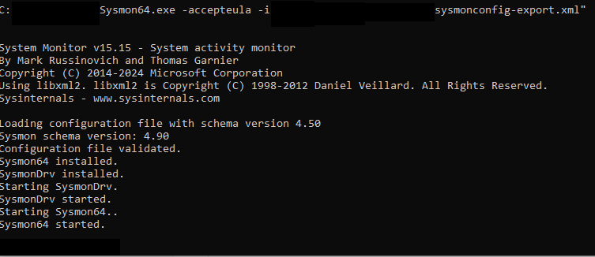

*Installing Sysmon with a custom configuration.*

- Verify that Sysmon is working
  - Open **Event Viewer**
  - Navigate to **Applications and Services Logs** > **Microsoft** > **Windows** > **Sysmon** > **Operational**
  - If you see logs with event IDs like 1, 3, or 11 Sysmon is working.

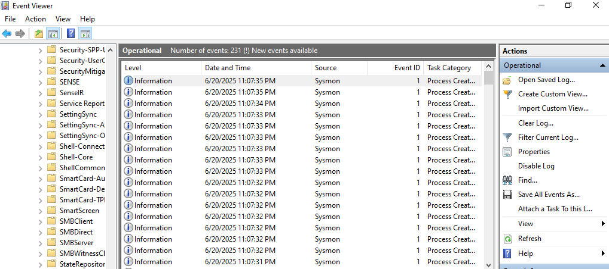
*Verify Sysmon is working by checking Event Viewer.*

7. Verify that the Security logs are being indexed by running the following command in Splunk's Search & Reporting app:
```sql
index=* sourcetype=WinEventLog:Security
```

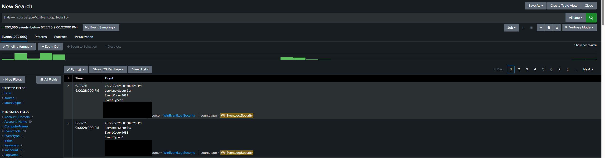  
*Verify that security logs are being indexed correctly in Splunk. Successful results confirm that data ingestion from the Universal Forwarder is working.*

### Exercise 3: Detecting Suspicious Events

Run several SPL queries to detect security events:

**🔐 Failed Login Attempts**
```spl
index=* sourcetype=WinEventLog:Security EventCode=4625
| stats count by Account_Name, host, _time
```

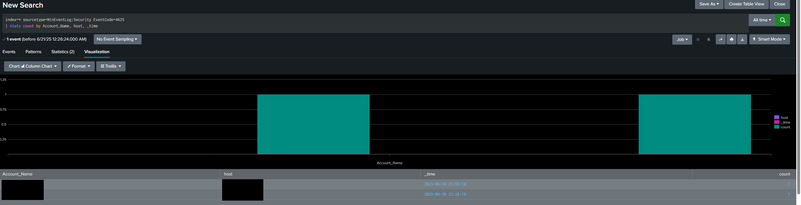  
*Splunk search query and results displaying which users have the highest number of failed login attempts using EventCode 4625. Helps detect brute-force or credential stuffing attempts.*

**👤 New User Account Creation**
```spl
index=* sourcetype=WinEventLog:Security EventCode=4720
```

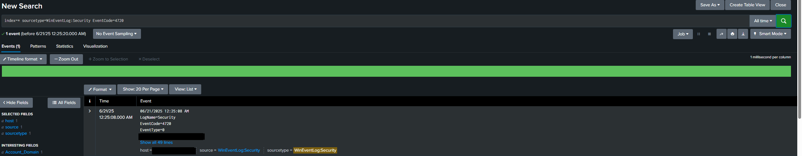  
*Splunk search query and results that tracks when new user accounts are created in the system using Eventcode 4720. This helps detect unauthorized account creations or insider activity that could indicate a security breach.*

**⚙️ Recent Process Creations Events**
```spl
index=* source="WinEventLog:Security" EventCode=4688
| rex field=_raw "New Process Name:\s+(?<Image>.+)"
| rex field=_raw "Process Command Line:\s+(?<CommandLine>.+)"
| table _time, Image, CommandLine
| sort -_time
```
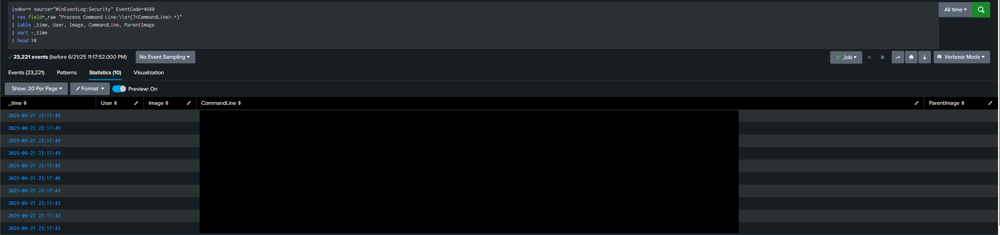  
*Splunk search query and results that displays recent process creation activity using EventCode 4688. Helps identify unexpected or unauthorized software executions.*

**🧨 Suspicious Process Execution (from unusual folders)**
```spl
index=* source="WinEventLog:Security" EventCode=4688
| rex field=_raw "New Process Name:\s+(?<Image>.+)"
| rex field=_raw "Process Command Line:\s+(?<CommandLine>.+)"
| where like(Image, "%\\AppData\\%") OR like(Image, "%\\Temp\\%") OR like(Image, "%\\Downloads\\%") OR like(Image, "%\\ProgramData\\%") OR like(Image, "%\\Public\\%")
| table _time, Image, CommandLine
| sort -_time
```
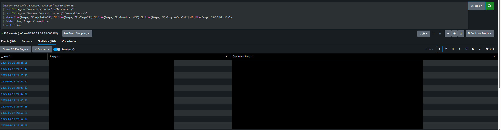  
*Splunk search query and results that highlights potentially suspicious process activity by filtering EventCode 4688 events where processes are executed from uncommon locations such as `%AppData%`, `%Temp%`, `%Downloads%`, or `%ProgramData%`. This helps identify behaviors often associated with malware or unauthorized scripts.*

### Exercise 4: Dashboards
- Create a Splunk dashboards to visualize key security activity using SPL queries. The dashboard includes panels for:
  - Top failed login accounts
  - Login failure trend over time
  - Recent Process Creations Events
  - Suspcious Process Executions from Unusual Locations

#### 🛠️ Steps to Build the Dashboard
1.  Go to the **Search & Reporting** app in Splunk.
2.  Run one of the SPL queries above.
3.  Click **Save As** -> **Dashboard Panel.**
4.  Choose an exisiting dashboard or create a new one (e.g., Security Monitoring).
5. Enter a **panel title**.
6. Select a **visualization type** appropriate for the data:
  - **Bar Chart** for Top Failed Login Attempts
  - **Line Chart** for Login Failures Over Time
  - **Statistics Table** for Process Creation and Suspicious Process
7. Click **Save**
- Repeat steps 2-7 for each query to complete your dashboard.

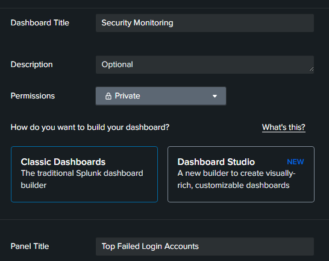

*Building a new dashboard titled “Security Monitoring” and assigning a panel title during the save process.*

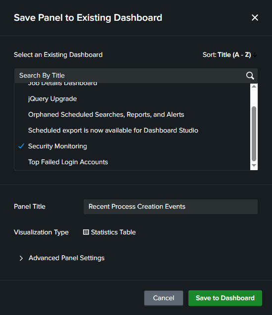  
*Selecting an existing dashboard (Security Monitoring) to add a new panel.*

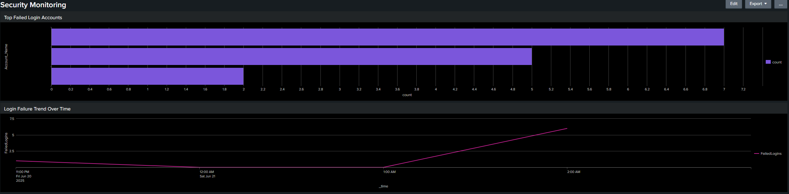  
*Top half of the custom dashboard showing failed login attemps and login trends.*

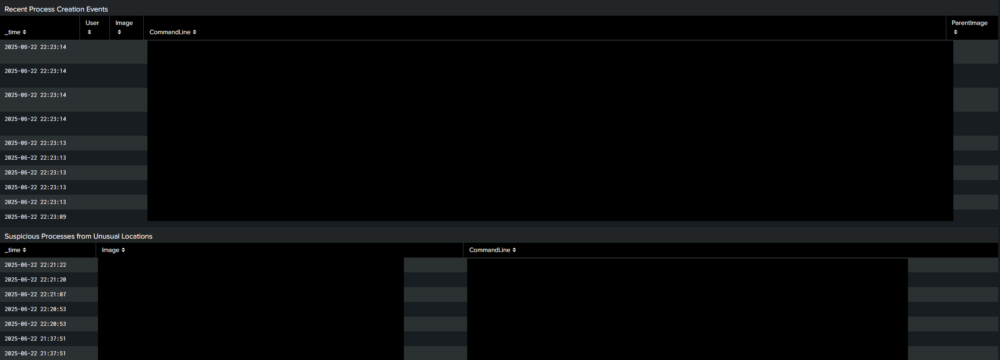  
*Bottom half of the custom dashboard showing recent and suspicious process execution.*

## 🧠 What I Learned
- How to ingest and search logs in Splunk
- Basic detection techniques using SPL
- Build informative dashboards for SOC visibility
